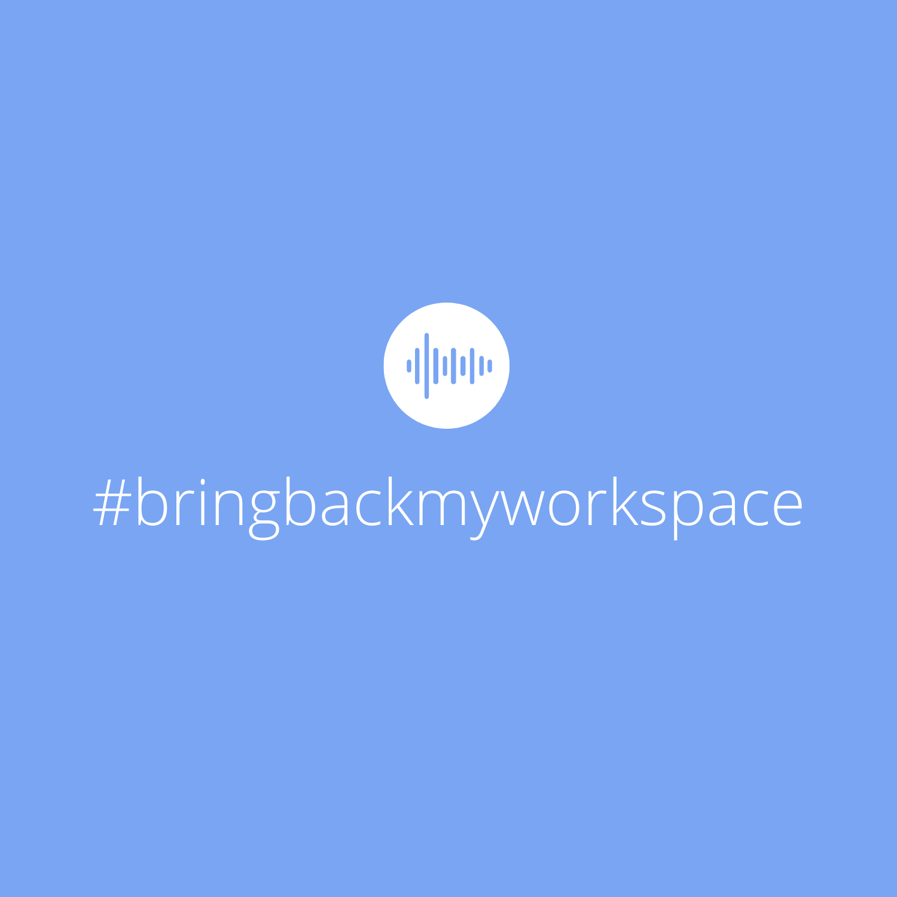

[](https://app.netlify.com/sites/bring-back-my-workspace/deploys)

# Bring back my workspace

Experiments with real-time audio processing in an effort to bring back our workspaces https://bringbackmyworkspace.live. This was a hack built at [Arcesium](https://arcesium.com) Hackathon 2020 in 24 hrs. #bringbackmyworkspace takes us back to our workspaces using spatial audio technologies. Its a new paradigm in communication.



## Technologies used 🧑‍💻

- WebRTC
- WebAudio
- Omnitone
- Web technologies

## Demo


## How to run locally?

```bash
npm install -g serve
serve
```

Open http://localhost:5000/

## Contributors

[@sreekanthnaga](https://twitter.com/sreekanthnaga)
[@varunkumar](https://twitter.com/varunkumar)
